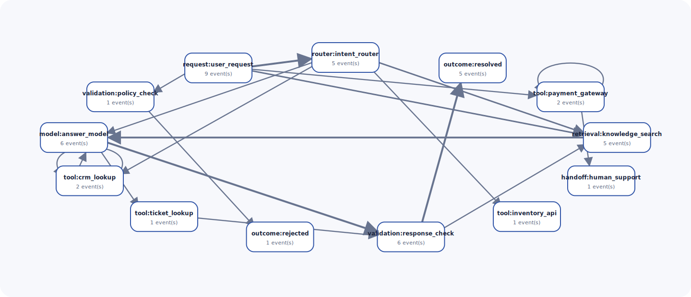

# JourneyGraph

Local-first graph analytics for recurring paths, loops, failures, and outcomes across
AI-agent traces and event data.

> **JourneyGraph does not collect traces. It analyzes the traces and event exports you already
> have.** Core analysis runs locally, needs no account or API key, and sends no telemetry.



Tracing tools help inspect one execution. JourneyGraph answers population-level questions:
Which paths recur across many executions? Where do agents retry, loop, fail, hand off, or drop
off? Which exact paths are associated with outcomes, and how do latency, token use, or cost
differ globally or across retained cohorts?

JourneyGraph 0.1 is an early alpha with a deliberately narrow, tested contract. It turns
canonical JSONL, CSV, optional Parquet, or one supported OTLP/JSON request shape into a
deterministic aggregate graph, machine-readable analysis, normalized events, static HTML, and
standalone SVG.

## Five-minute quickstart

Python 3.11 or later is required. From a fresh checkout, this single setup-and-demo command
installs the standard-library runtime core and generates a complete synthetic report:

```bash
git clone https://github.com/GermanGerken/journeygraph.git
cd journeygraph
python3 -m venv .venv && . .venv/bin/activate && python -m pip install . && journeygraph demo --output-dir journeygraph-demo
```

Open `journeygraph-demo/report.html` in a browser. The command also writes:

```text
journeygraph-demo/
├── analysis.json
├── demo-traces.jsonl
├── graph.svg
├── normalized.jsonl
└── report.html
```

The packaged demo is deterministic and entirely synthetic. Its current output contains 45
events across 9 traces, 13 aggregate nodes, 19 unique transitions, 2 retry categories, and 3
exact return-loop sequences. Outcomes are 5 successes, 2 failures, 1 handoff, and 1 drop-off.

## Analyze your own export

Canonical JSON Lines contains one operation per line:

```json
{"schema_version":"1.0","trace_id":"trace-1","step_id":"request","timestamp":"2026-07-21T08:00:00Z","operation_type":"request","component":"user_request","duration_ms":4,"status":"ok"}
{"schema_version":"1.0","trace_id":"trace-1","step_id":"answer","parent_step_id":"request","timestamp":"2026-07-21T08:00:00.125Z","operation_type":"outcome","component":"completed","duration_ms":1,"status":"ok","outcome":"success"}
```

Validate first, then produce all four analysis artifacts:

```bash
journeygraph validate traces.jsonl
journeygraph analyze traces.jsonl --output-dir journeygraph-report
```

A compact part of `analysis.json` looks like this for the packaged demo:

```json
{
  "schema_version": "1.0",
  "totals": {
    "events": 45,
    "nodes": 13,
    "traces": 9,
    "transitions": 36,
    "unique_transitions": 19
  },
  "outcomes": {
    "counts": {
      "dropoff": 1,
      "failure": 2,
      "handoff": 1,
      "success": 5,
      "unknown": 0
    }
  }
}
```

Use `--cohort-key environment` to compare retained operational cohorts. Use repeatable
`--allow-metadata-key KEY` options only for additional non-sensitive operational fields.
Sensitive-key rules remain permanent even when a key is requested explicitly.

## What it computes

- Aggregate nodes for exact `(operation_type, component)` categories and weighted directed
  transitions between adjacent steps.
- Complete exact paths with stable SHA-256 identities and frequency/outcome summaries.
- Adjacent exact-category retries and non-adjacent return loops, reported separately.
- Reconciled success, failure, handoff, drop-off, and unknown outcomes.
- Failure points, drop-off points, entries, terminals, and successful versus non-successful
  path comparisons.
- Event-level duration, token, and supplied-cost summaries with explicit missing counts.
- Optional cohort summaries based on retained metadata.
- Structured data-quality and privacy warnings without echoing rejected values.

All ordering, IDs, aggregates, JSON, normalized JSONL, HTML, and SVG are deterministic for the
same accepted input and configuration. Parent links are diagnostics; normalized chronological
order is authoritative, with `step_id` as the equal-timestamp tie-breaker.

## Supported inputs

| Input | Maturity | Boundary |
| --- | --- | --- |
| JSON Lines | Stable canonical v1 | One `journeygraph.event/v1` object per line. |
| CSV | Stable canonical v1 | Same scalar fields; metadata uses `metadata.<key>` columns. |
| Parquet | Optional canonical v1 | Same logical columns through `journeygraph[parquet]` and PyArrow. |
| OTLP/JSON | Experimental | Explicit `--format otlp-json`; one uncompressed OTLP/HTTP `ExportTraceServiceRequest` JSON body. |

The experimental importer verifies an official OTLP request shape and maps a documented
subset of OpenTelemetry and OpenInference attributes. It is not a collector, live receiver,
gRPC or protobuf-binary decoder, generic JSON importer, or claim of Langfuse/Phoenix/provider
compatibility. Validate a representative sanitized export before relying on it. See the exact
[data schema and mappings](docs/schema.md).

## Where it fits

For AI systems, a journey might be:

```text
request -> router -> retrieval -> model -> tool -> validation -> outcome
```

The same canonical model also supports non-AI operational journeys such as service workflows,
batch pipelines, product events, support escalation, approval processes, or test-run steps.
JourneyGraph describes observed associations; it does not infer causes or judge quality.

The implementation keeps provider-specific decoding at the ingestion boundary:

```text
local export -> reader -> validation/privacy normalization -> aggregate graph
             -> deterministic analytics -> JSON + normalized JSONL + HTML + SVG
```

The analytical core uses only the Python standard library. Optional PyArrow is isolated to
Parquet ingestion. See [Architecture](docs/architecture.md) for dependency boundaries and
stable identity rules.

## Privacy and security boundary

JourneyGraph denies metadata by default except for a small operational allowlist. Keys matching
the documented sensitive fragments—including prompt, message, document, credential, token,
email, and common identifier names—are permanently excluded. Reports escape untrusted markup;
HTML has no executable JavaScript or remote dependency, and SVG has no scripts or remote
resources.

This is key-based filtering, not content inspection, anonymization, or a DLP system. An
arbitrary custom key or value can still identify someone even when its name does not match the
denylist. Retained IDs, timestamps, labels, allowed values, rare paths, and `normalized.jsonl`
may still be sensitive. Inspect artifacts before sharing them. Read the full [Privacy and
Threat Model](docs/privacy.md).

## Quality and reproducibility

The repository has three test layers: pure unit tests, real-file integration tests, and
black-box installed-CLI functional tests. The acceptance suite covers deterministic ordering,
branches, retries, loops, outcomes, malformed data, duplicates, privacy leakage, hostile
markup, Unicode, output safety, canonical formats, representative OTLP/JSON, and a real
Parquet file when the optional dependency is installed.

The canonical local gate enforces Ruff formatting/linting, strict mypy, combined statement and
branch coverage of at least 90%, an isolated wheel smoke test, documentation contracts,
dependency auditing, Bandit, and secret scanning:

```bash
make setup
make verify
```

Mutation testing and the deterministic 2,000-trace benchmark are explicit additional checks:

```bash
make mutation
make benchmark
```

CI runs the same Make targets on Python 3.11, 3.12, 3.13, and 3.14. No remote CI result is
claimed until that workflow actually runs. See [Testing and Quality](docs/testing.md).

## Current limitations and non-goals

- Batch, local, in-memory analysis only; no collection, streaming, server, hosted service, or
  graph database.
- Exact category and path grouping only; no fuzzy clustering, causal inference, prediction,
  anomaly truth, or LLM-as-a-judge.
- OTLP/JSON support is intentionally narrower than the complete protocol and semantic
  convention surface.
- Supplied token and cost values are summarized as-is; provider pricing is not recalculated.
- Whole multi-file publication is not transactional, although each artifact uses guarded
  sibling replacement.
- Native Windows development commands are not yet a tested interface; the documented harness
  uses a POSIX shell or WSL.

## Roadmap

Near-term work should be driven by sanitized real-export evidence: harden canonical and OTLP
adapters, improve large-input behavior, add explainable comparisons and filtering, and expand
visual navigation without weakening static/local guarantees. Leakage-safe prefix prediction
is a possible later experiment only after temporal evaluation and privacy safeguards exist; it
is not part of 0.1.

## Documentation

- [CLI and Python API](docs/cli.md)
- [Data and Analysis Schemas](docs/schema.md)
- [Architecture](docs/architecture.md)
- [Privacy and Threat Model](docs/privacy.md)
- [Privacy-safe real-trace discovery](docs/real-trace-discovery.md)
- [Testing and Quality](docs/testing.md)
- [Product brief](docs/product-brief.md)
- [MVP execution plan](docs/exec-plans/journeygraph-mvp.md)
- [Real-trace discovery execution plan](docs/exec-plans/real-trace-discovery.md)
- [PyPI Trusted Publishing preparation](docs/exec-plans/pypi-trusted-publishing.md)
- [Release process](docs/releasing.md)

The experimental standards boundary is anchored to the [OTLP
specification](https://opentelemetry.io/docs/specs/otlp/), pinned [OpenTelemetry protobuf
v1.10.0](https://github.com/open-telemetry/opentelemetry-proto/tree/v1.10.0), and
[OpenInference semantic conventions](https://arize-ai.github.io/openinference/spec/semantic_conventions.html).

## Contributing

Issues and small, evidence-backed changes are welcome. Significant changes to schema meaning,
privacy, stable identities, format compatibility, or architecture need an approved ExecPlan.
Please read [CONTRIBUTING.md](CONTRIBUTING.md), the [Code of Conduct](CODE_OF_CONDUCT.md), and
the [Security Policy](SECURITY.md) before submitting material.

## License

JourneyGraph is available under the [Apache License 2.0](LICENSE).
